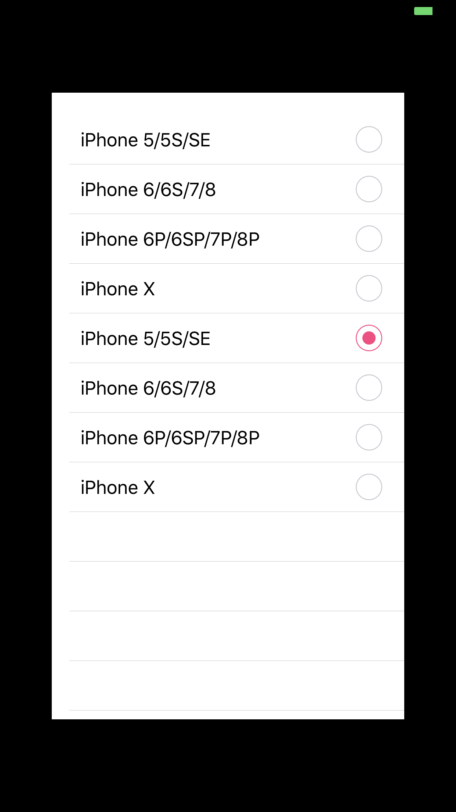

# Simulate all devices into one real iPhone

1. iOS Developer? 
2. Devices Compatible?
3. Devices Without All Resolutions?

`RealSimulator` can be help you.

## Install

Carthage only !!!

```bash
github "XWJACK/RealSimulator"

# New Run Script with debug only 
if [ "$CONFIGURATION" == "Debug" ]; then
/usr/local/bin/carthage copy-frameworks
fi
# Add to Input Files
$(SRCROOT)/Carthage/Build/iOS/RealSimulator.framework
# Add to Output Files
$(BUILT_PRODUCTS_DIR)/$(FRAMEWORKS_FOLDER_PATH)/RealSimulator.framework
```

## Usage

```swift
#if DEBUG
import RealSimulator
typealias RSWindow = RealSimulator.RSWindow
#endif

class AppDelegate: UIResponder, UIApplicationDelegate {
    
#if DEBUG
	var window: RSWindow?
#else
	var window: UIWindow?
#endif

	func application(_ application: UIApplication, didFinishLaunchingWithOptions launchOptions: [UIApplicationLaunchOptionsKey: Any]?) -> Bool {
	   // Override point for customization after application launch.
	   
	#if DEBUG
	   window = RSWindow(frame: UIScreen.main.bounds)
	#else
	   window = UIWindow(frame: UIScreen.main.bounds)
	#endif
	   
	   window?.rootViewController = UITabBarViewController()
	   window?.makeKeyAndVisible()
	   
	   return true
	}
}
```

<table>
 <tr>
  <td>
    
    <p> iPhone 8P => iPhone X <p/>
  </td>
  <td>
    
    <p> iPhone 8P => iPhone SE <p/>
  </td>
 </tr>
</table>

# Donate

If you think it useful, you can send me some BTC? ETH? or any crypto coin using [GitThanks](https://gitthanks.com/)

Thanks!

